# 🩺 HealthMate — MERN Stack App

HealthMate is an intelligent MERN stack web application that allows users to upload and analyze health reports using Gemini AI, and also chat with an integrated AI Health Assistant for instant feedback.

Built with React.js, Express.js, MongoDB, and Node.js, HealthMate combines smart AI insights with a beautiful, responsive interface.

## 🚀 Live Links

### 🔹 Frontend GitHub Repository
👉 [https://github.com/ibrahimhussainofficial/healthmate](https://github.com/ibrahimhussainofficial/healthmate)

### 🔹 Frontend (Vercel)
👉 [https://healthmateofficial.vercel.app/](https://healthmateofficial.vercel.app/)

### 🔹 Backend (Railway)
👉 [https://healthmatebackend-production-c651.up.railway.app](https://healthmatebackend-production-c651.up.railway.app)

### 🔹 Backend GitHub Repository
👉 [https://github.com/ibrahimhussainofficial/healthmatebackend](https://github.com/ibrahimhussainofficial/healthmatebackend)

---

## 🧠 Features
✅ AI Report Analyzer (Gemini) — Upload lab reports and get intelligent health insights generated by Google’s Gemini AI.
💬 AI Chatbot Assistant — Chat with an integrated health assistant powered by AI for instant suggestions and explanations.
🧾 Secure File Uploads — Upload PDF or image reports safely with server-side processing.
🧍‍♂️ User Authentication — Secure login/signup with JWT tokens.
📊 MongoDB Integration — Store and manage user data efficiently.
🎨 Responsive Design — Built with Tailwind CSS for a smooth experience across all devices.

## 🖼️ Screenshots

### Register Page
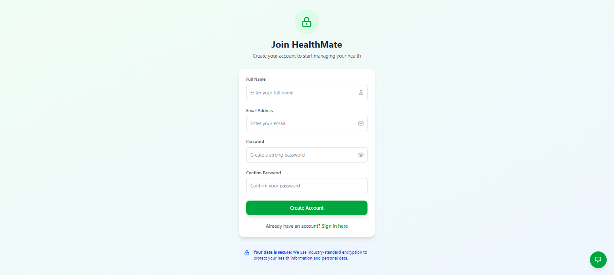

### Login Page
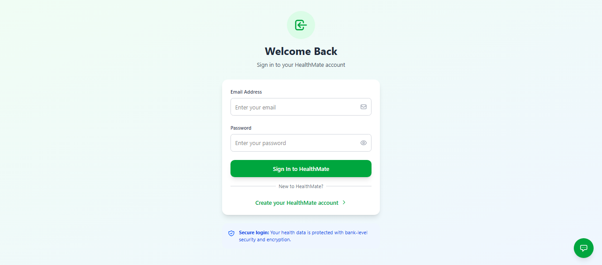

### Empty Dashboard Page
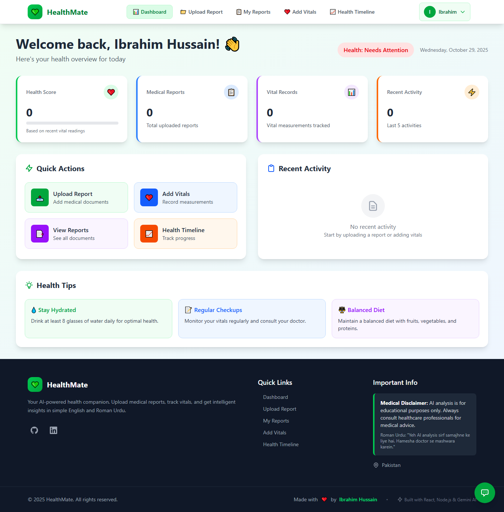

### Dashboard Page With Data
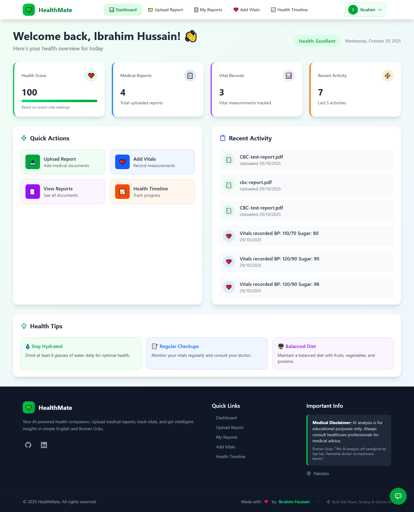

### Add Vitals Page
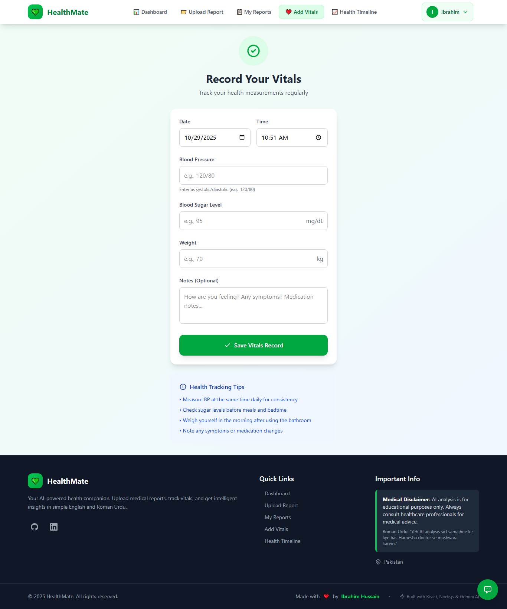

### Saved vitals Preview Page
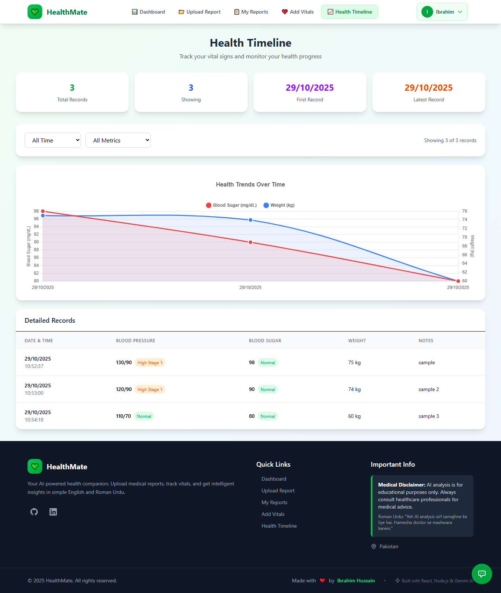

### User Details
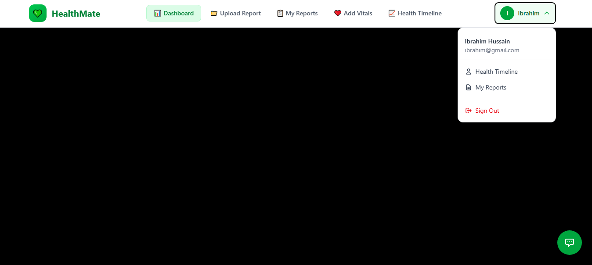

### Chatbot
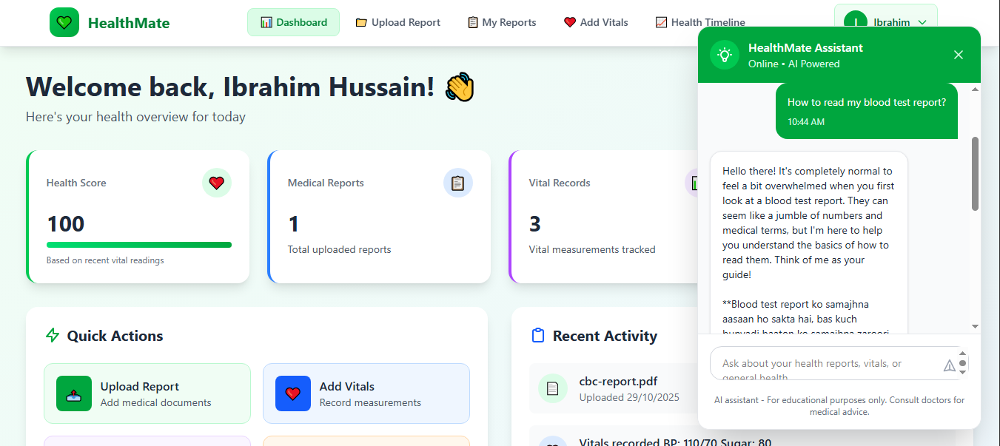

### Upload Page
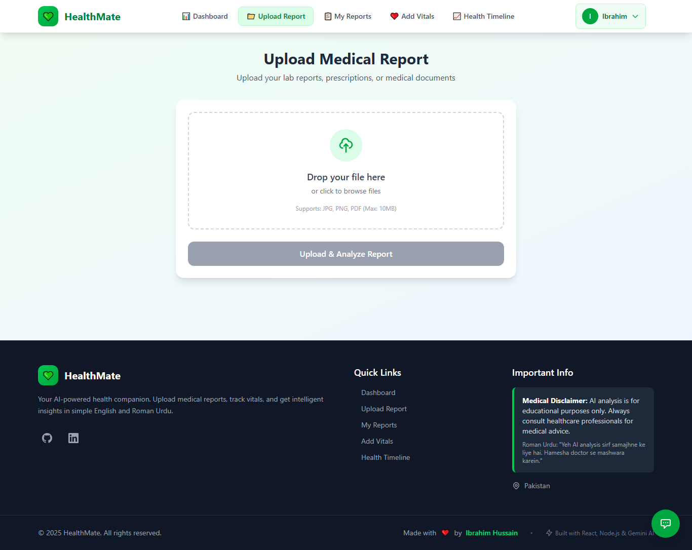

### After Upload Page
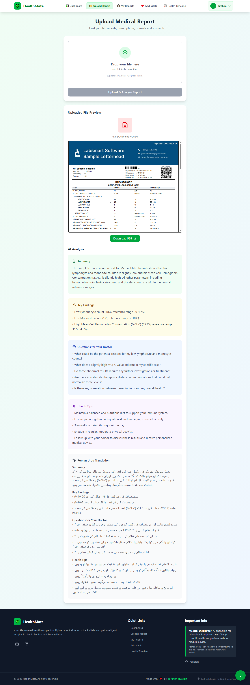

### Saved Report Analyze Page
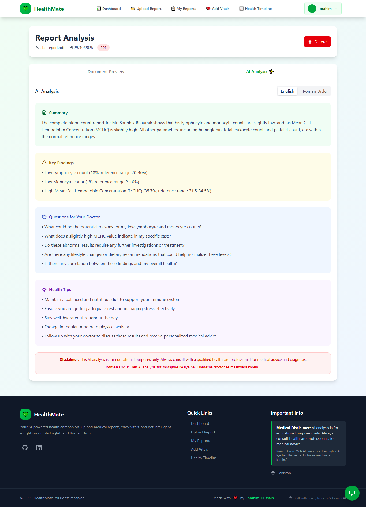

### Saved Report Preview Page
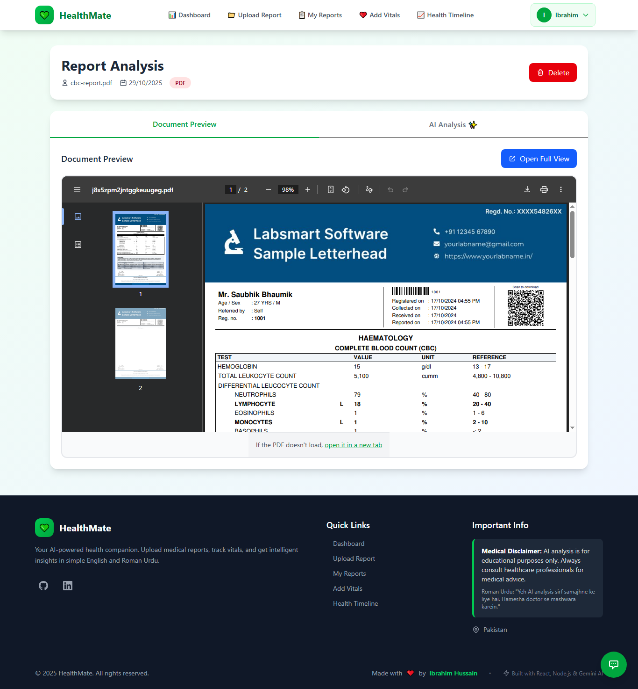

### Total Reports Page
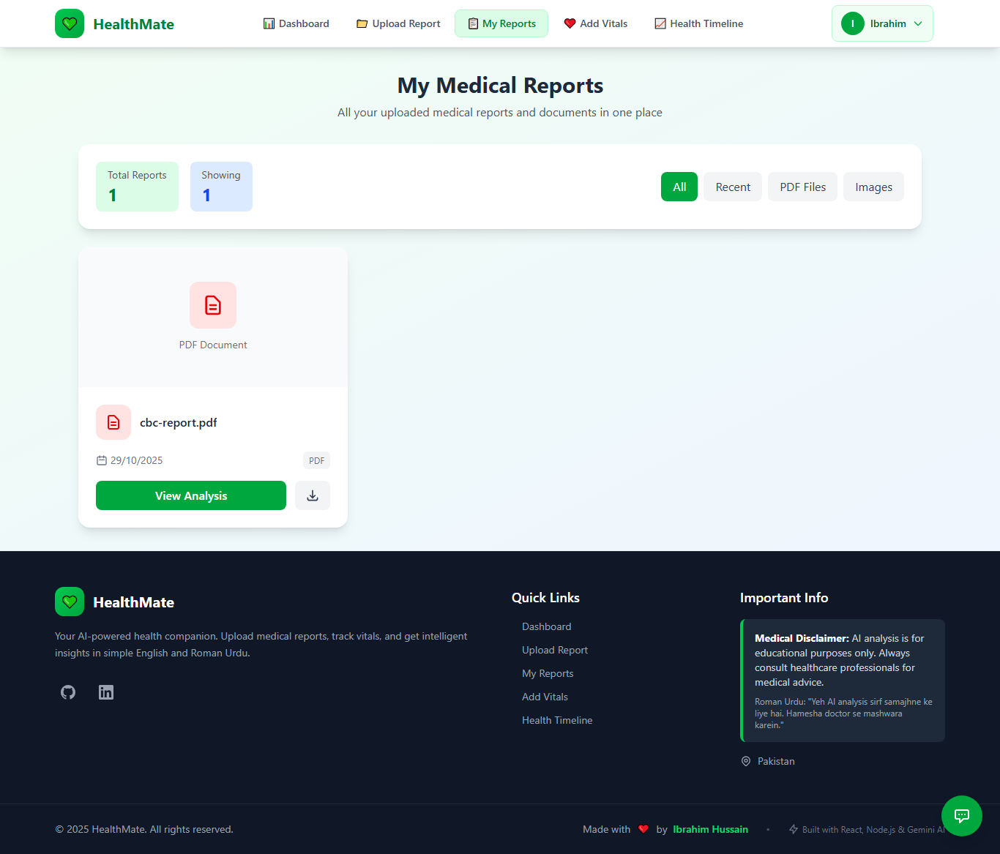

## 🛠️ Tech Stack

| Category | Technology |
|-----------|-------------|
| Frontend | React.js, Axios, Tailwind CSS |
| Backend | Node.js, Express.js |
| Database | MongoDB (Atlas) |
| AI | Gemini API (Google Generative AI)
| Hosting | Vercel (frontend), Railway (backend) |

---

👨‍💻 Developer
Ibrahim Hussain
📍 Karachi, Pakistan
[LinkedIn](https://www.linkedin.com/in/ibrahimhussainofficial/)

🧠 AI Credit

HealthMate uses Gemini AI for advanced health report analysis and chatbot conversation capabilities.
Gemini enables intelligent text interpretation, summarization, and user assistance to make medical data more understandable.